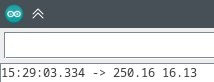

# Задание 

Сравнить работу программы, написанной для первой лабораторной работы с работой того же кода на Arduino Uno R4.

## Уточнение

Arduinu Uno R4 не поддерживает возможность прямого обращения к портам (с помощью PORTD или PORTB), поэтому код программы для нее был немного изменён (замена прямого обращения к портам на DigitalWrite).

# Результаты работы

Для замера был выбран 6 пин на обеих платах (250 мкс). Сами замеры производились при помоши платы Arduino Mega и программы из второй лабораторной работы (в выводе сначала идет значение математического ожидания времени импульса, а после него значение среднего квадратичнного отклонения; обе величины посчитаны на основе 100 импульсов и измеряются в микросекундах).

## Arduino Uno R3

## Arduino Uno R4

# Вывод

На основе полученных результатов можно сделать следующие выводы:

* Плата Uno R3 в среднем выдает менее точный результат, с меньшим разбросом;
* В то же время Uno R4 в среднем выдает максимально приближенных к истине результат, но имеет более большое отклонение.

Говоря простым языком, Uno R3 постоянно с небольшим разбросом выходит за рамки необходимой длины импульса, в том время как Uno R4, имея больший разброс, в среднем показывает длину импульса, наиболее приближенную к необходимой. 

